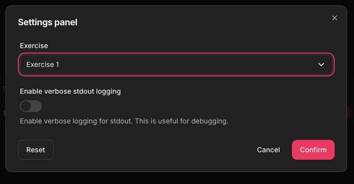

# AI Agents in Action: Building Smart, Open-Source LLM Workflows
This is the official repository of the [Open Source AI Workshop](https://www.ch-open.ch/open-source-ai-workshops/) with the above name that takes place on May 9, 2025 at Bern University of Applied Sciences, Brückenstrasse 73, 3005 Bern.

# First steps

## 1. Installing uv

Please install the package and project manager **uv** for Python. You can install it directly via pip:

```bash
pip install uv
```

Alternatively, follow one of the installation procedures described [here](https://docs.astral.sh/uv/getting-started/installation/).

## 2. Installing the dependencies

After you installed uv, you can  use the following command to install the required Python dependencies:

```bash
uv sync
```

# Repository structure

The repository is structured as follows:

1. The module `aia25` contains the UI that interacts directly calls the agents that you will implement.
2. Modules `exercise01` to `exercise04` contain the exercise code. The first exercise is just the setup so there is no solution.
3. Modules `solution_exercise02` to `solutions_exercise04` contain the solutions.


# Running the app

You can either run the UI using the vscode config or using the command `uv run chainlit run aia25/app.py -w -h`.

If you first execute `uv pip install -e .` in the project root you will have access to the shorthand command `uv run app`, which will also just start the UI.

# Selecting an agent to run

To choose which agent you want to interact with, click on the gear icon on the left hand side of the chat:


There you will be able to choose which agent is executed (using the `execute_agent` function implemented in the `my_agents.py` in each module):

